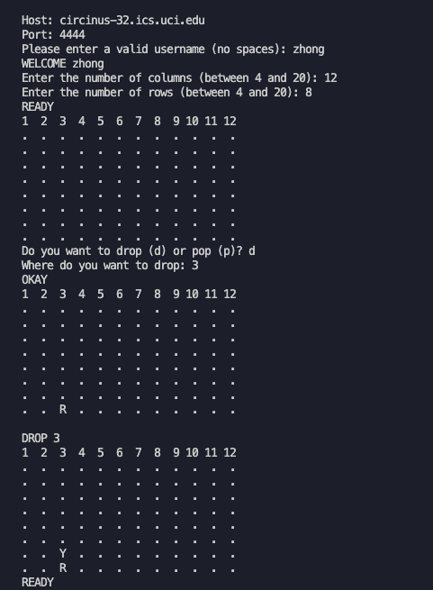
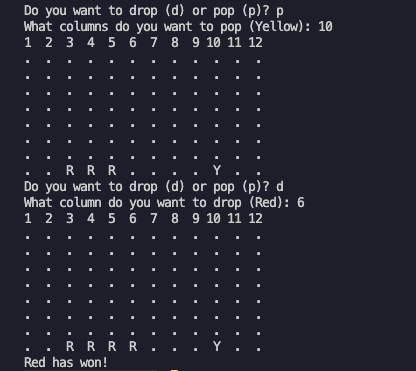

# Connect Four

The connect four game runs in the command line and either has two players or one player and one ai playing. In order to play with the ai you need to connect to a specific uci server and connect to a socket. From this project I learned how to connect and receive messages through a socket in python. I also needed to handle erroneous inputs and create a game board according to what the user requested. Gameboard would have to be updated and printed after each move. This was for a project in my cs class at uci.

